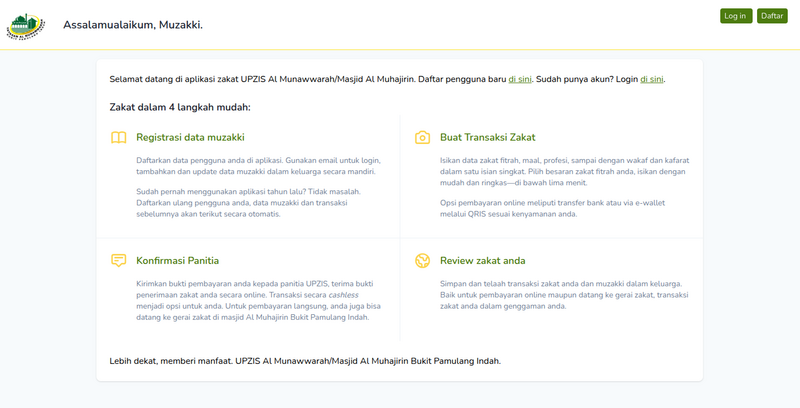
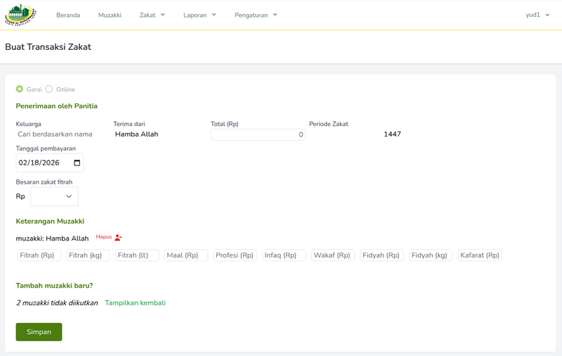

# Alma UPZIS

Alma UPZIS is a web application built with the Laravel framework. It provides robust tools for managing Zakat, Infaq, and Sadaqah operations, including user management, transaction tracking, reporting, and more, serving the needs of Al Muhajirin mosque located in southern Jakarta, Indonesia. 

## Application Preview




## How Alma UPZIS Works

Alma UPZIS is designed to streamline the management of Zakat, Infaq, and Sadaqah for UPZIS organizations. The application is built on Laravel and follows a modular structure, with clear separation between endpoints, services, and database models.

### Architecture Overview

```
+-------------------+
|   User Interface  |  <-- Vue.js SPA, Blade Views
+-------------------+
         |
         v
+-------------------+
|   Laravel Routes  |  <-- /routes/web.php, /routes/api.php
+-------------------+
         |
         v
+-------------------+
|   Controllers     |  <-- ZakatController, MuzakkiController, FamilyController, etc.
+-------------------+
         |
         v
+-------------------+
|   Services/Domain |  <-- Business logic, ResidenceDomain, ZakatDomain, etc.
+-------------------+
         |
         v
+-------------------+
|   Models          |  <-- Zakat, Muzakki, Family, User, etc.
+-------------------+
         |
         v
+-------------------+
|   Database        |  <-- MySQL, migrations, seeders
+-------------------+
```


### Main Features & Flow

- **User Authentication:** Uses Laravel Sanctum for secure login and role-based access.
- **Zakat Management:** Both admins and muzakkis can create zakat transactions. Admins have additional capabilities to confirm payments, view recaps, and export data. Muzakkis (donors) can log in and submit their own zakat transactions through the application. The `ZakatController` handles daily recaps, online payments, and Muzakki lists.
- **Family & Muzakki Registration:** Users can self-register as muzakkis and add their family members. Registration endpoints and forms allow new users to sign up, create their muzakki profile, and link or register their family. Family members can be managed and assigned to zakat transactions.
- **Reporting & Export:** Data can be exported in various formats for reporting, using endpoints like `/zakat/export/{type}/{hijriYear?}`.
- **Role Management:** Admins can assign and manage roles for users, ensuring proper access control.

### Database Models

- `User`: Authentication and role management.
- `Zakat`, `ZakatLine`, `ZakatLog`: Core Zakat transaction and history.
- `Muzakki`: Donor information.
- `Family`: Family registration and linkage.
- `AppConfig`, `Role`, `SequenceNumber`: Application configuration and supporting data.

## Getting Started

### Prerequisites

- PHP >= 8.0
- Composer
- Node.js & npm
- MySQL or compatible database

### Installation

1. **Clone the repository:**

   ```bash
   git clone https://github.com/yud1-255/alma-app.git
   cd alma-app
   ```

2. **Install PHP dependencies:**

   ```bash
   composer install
   ```

3. **Install JavaScript dependencies:**

   ```bash
   npm install
   ```

4. **Copy and configure environment file:**

   ```bash
   cp .env.example .env
   # Edit .env to set your database and app settings
   ```

5. **Generate application key:**

   ```bash
   php artisan key:generate
   ```

6. **Run migrations and seeders:**

   ```bash
   php artisan migrate --seed
   ```

7. **Build frontend assets:**

   ```bash
   npm run dev
   ```

8. **Start the development server:**
   ```bash
   php artisan serve
   ```

### Running Tests

```bash
php artisan test
```

## Contributing

- Follow Laravel's coding standards.
- Submit pull requests with clear descriptions.
- See the official [Laravel documentation](https://laravel.com/docs) for framework details.

## License

This project is open-sourced under the [MIT license](https://opensource.org/licenses/MIT).
